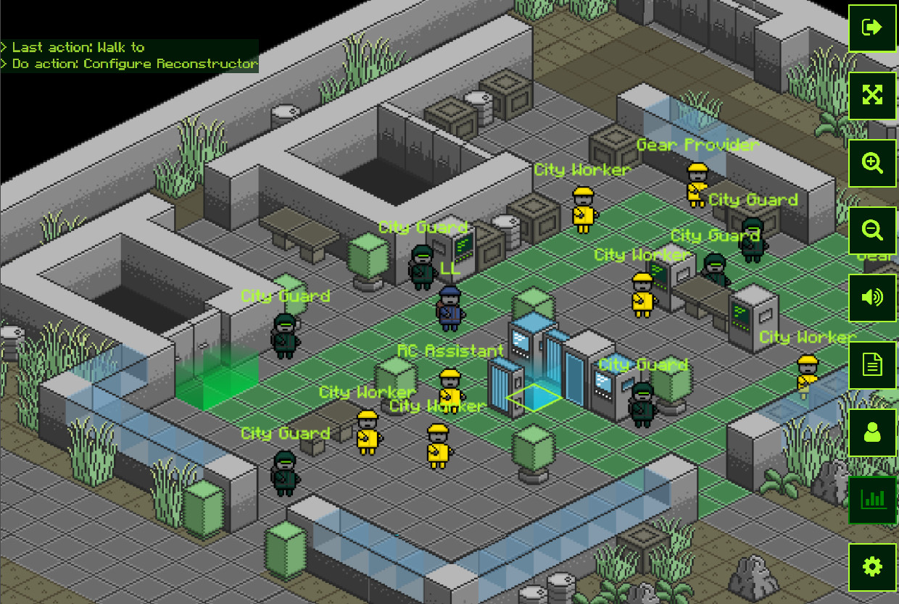

# open_world
Tile based open world multiplayer rpg.



This is my free time project and currently I won't be accepting any pull requests but feel free to experiment and learn from this project.

Requirements:
* nodejs v12.13.0 (probably works with older)
* npm

Deployment:

```
npm install
node ./server/index.js
```

Nice to know:
* Game starts on `http://localhost` and works with latest Chrome and Firefox on desktop and mobile.
* Area files are located in /server/resources/areas and can be edited with Tiled map editor.
* Sprite sheet is located in /client/res/tiles.png and it is used in both the game and the map editor

Live demo at https://open-world-game.herokuapp.com/

[Licence ISC](LICENCE.md)
